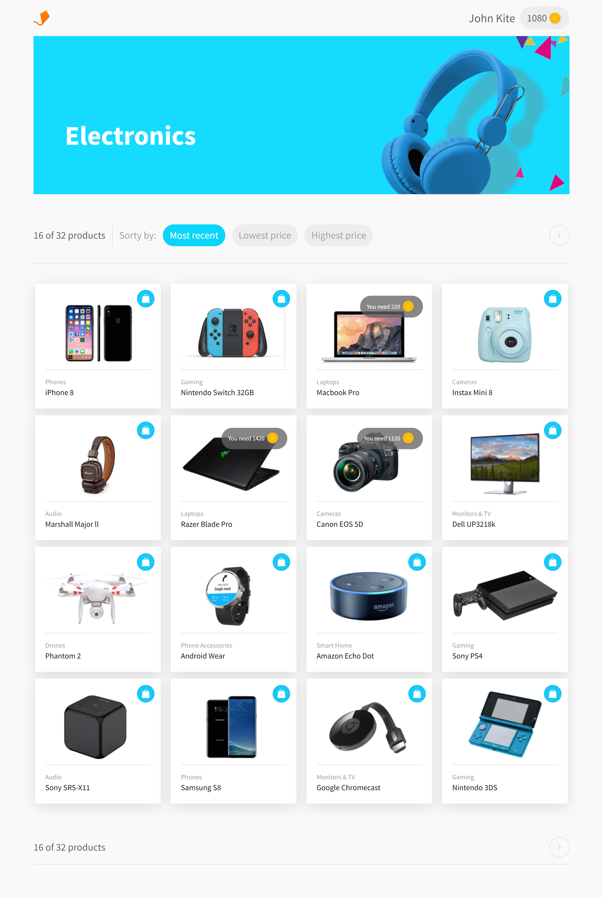

# Aerolab's Coding Challenge

This is a solution to the [Aerolab's Coding Challenge](https://aerolab.us/coding-challenge)

## Overview

### The challenge

- Each product should have a visible price in points.
- The user should be able to sort products by price, from highest to lowest, and vice-versa.
- The user should be able to see how many points they have in their account.
-T here should be a clear way for the user to distinguish those products that they can redeem from those they cannot.
- A “Redeem” button should be available for those products that the user has enough points to claim.
- A “Redeem now” option should appear when the user interacts with a product that they have enough points to claim.
- When the user doesn’t have enough points for a product, they should be able to see how many more points they need to claim it.
- The user should not be able to redeem a product for which they don’t have enough points.
- When the user clicks on the Redeem now button, the system should automatically deduct the item’s price from the users’ points.

### Screenshot

### Links

- Live Site URL: [Link](emiacerbi-aerolab-challenge.vercel.app/)

## My process

### Built with

- Semantic HTML5 markup
- CSS custom properties
- CSS Grid
- Mobile-first workflow
- [React](https://reactjs.org/) - JS library
- [Vite.js](https://vitejs.dev/) - React framework
- [Axios](https://axios-http.com/docs/intro) - For API calls
- [Sweet Alert](https://sweetalert2.github.io/) - For the alerts

### Useful resources

- [React Spinners](https://adexin.github.io/spinners/) - This is what I used for the spinners. 

## Author

- Website - [Personal Portfolio](https://personal-portfolio-six-flax.vercel.app/)
- Linked In - [Emi](https://www.linkedin.com/in/emiliano-acerbi-7a7141235/)